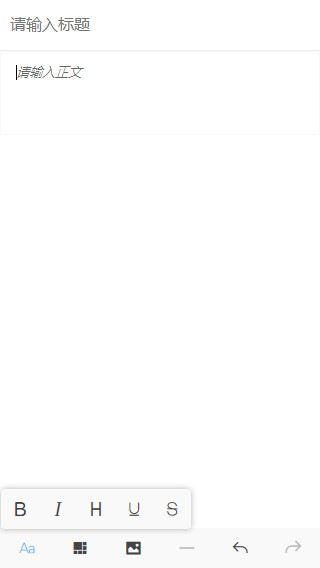
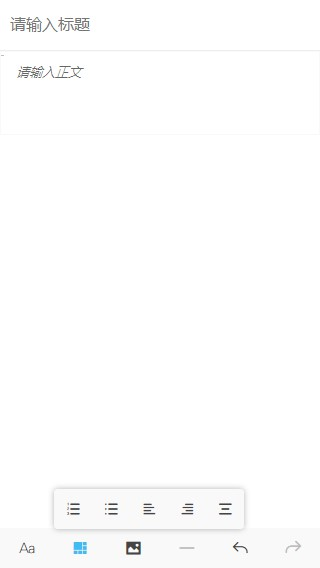

# quill-vue-mobile

一个 quill 的封装，用于移动端 webview 的跨平台富文本编辑器,类似知乎移动端富文本

## preview





## Project setup

```
npm install quill-vue-mobile
```

## usage

```vue
<template>
  <quill-vue-mobile
    :defaultValue="{ title: '我是默认标题', content: '我是默认内容' }"
    ref="editor"
    @upload-img="uploadImg"
    @title-change="titleChange"
    @content-change="contentChange"
  />
</template>

<script>
export default {
  data() {
    return {
      title: '',
    }
  },
  methods: {
    uploadImg() {
      this.$refs.editor.renderImg(
        'https://dss0.bdstatic.com/5aV1bjqh_Q23odCf/static/superman/img/logo_top-e3b63a0b1b.png'
      )
    },
    contentChange(w) {
      console.log('TCL: contentChange -> w', w)
    },
    titleChange(w) {
      console.log('TCL: titleChange -> w', w)
    },
  },
}
</script>

<style scoped></style>
```
